# DislinPlot 简介

虽然目前有很多用途广泛且功能强大的C++作图库，比如Qt Charts, Qwt，Matplot++, matplotlib-cpp等等，但往往**依赖繁琐且部署复杂，安装和编译配置较重**，对于那些只是想简单可视化数据方便查看和多平台程序移殖的C++开发者而言完全没必要。

[Dislin](https://www.dislin.de/)库是一个专门用于数据绘图的C++闭源图形库，支持多种编程语言和跨平台，但是并没有对各种类型的图进行友好的封装，实际使用起来比较**散乱和不方便**，<u>因此开发一个简单易用的作图库还是有一定意义的</u>。

`DislinPlot` 是对 [Dislin](https://www.dislin.de/)库的类`matplotlib` 风格 C++ 封装（仅使用头文件），提供折线图、散点图、柱状图、饼图、直方图及多子图布局等基本的**2D**图功能。

**注意当前只支持英文字符显示**。

# 效果展示

| 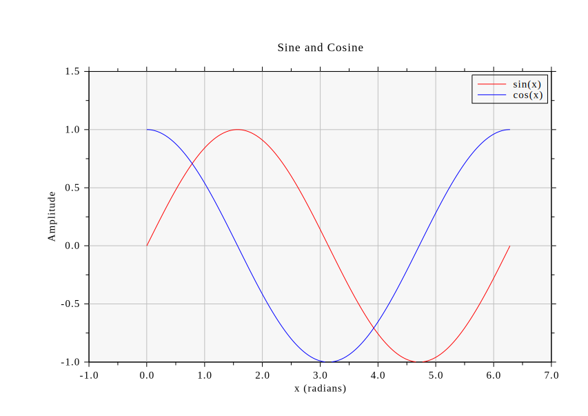       | 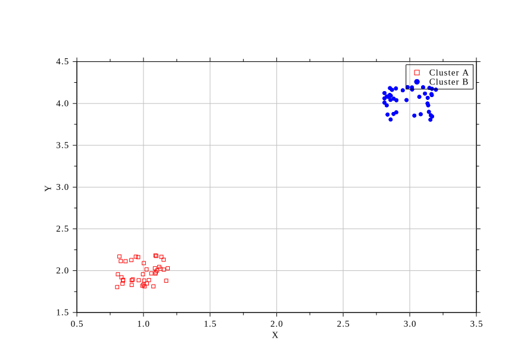             |
| ----------------------------------- | -------------------------------------------- |
| 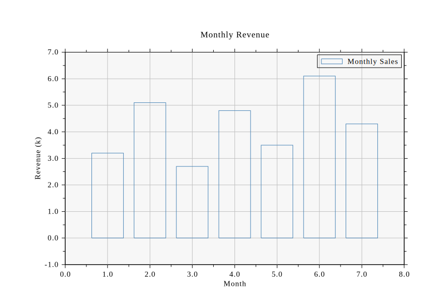        | 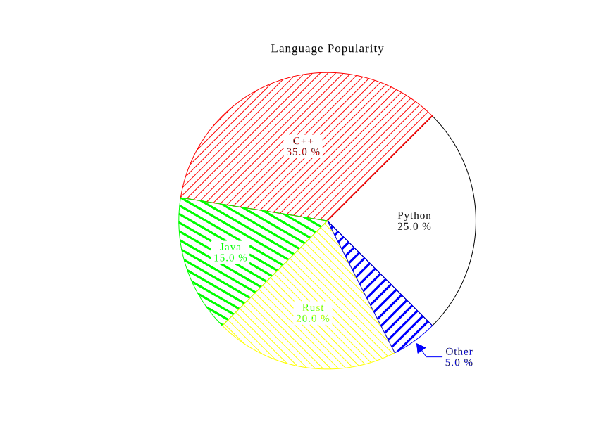                 |
| 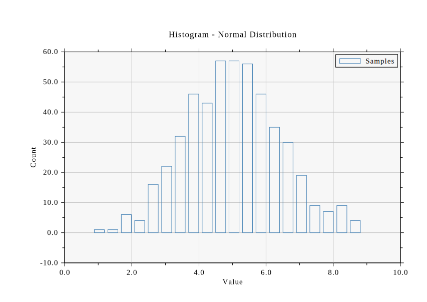       | 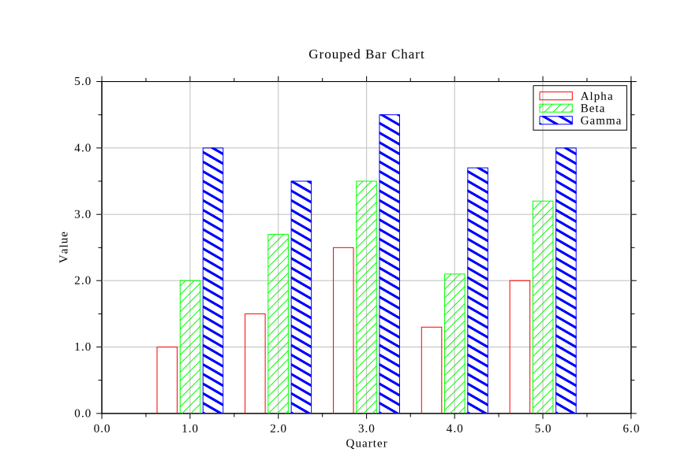        |
| 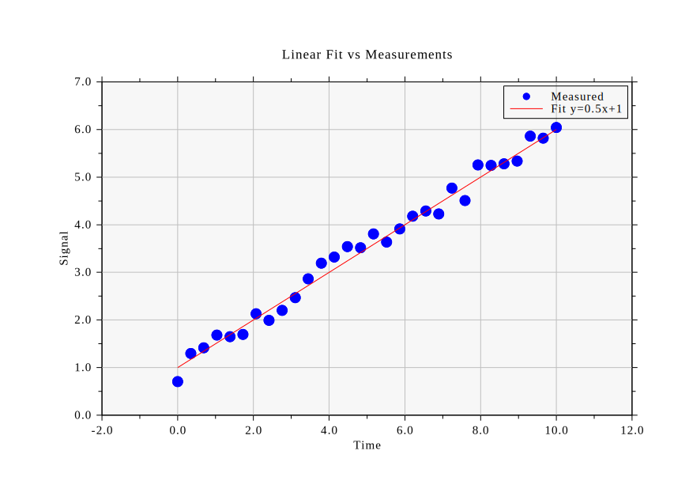 | 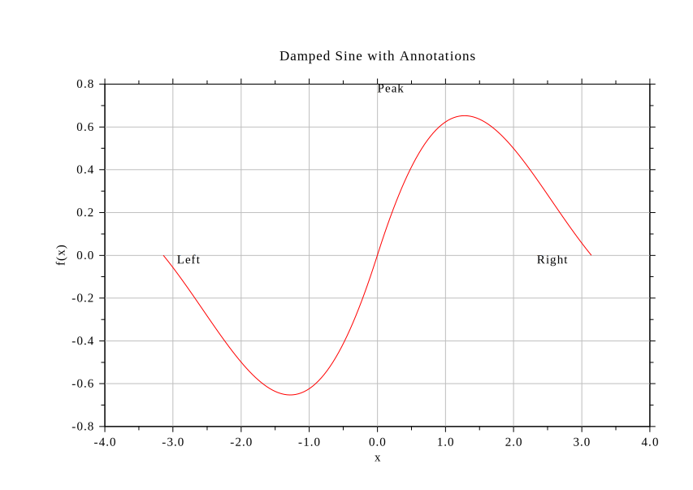           |
| 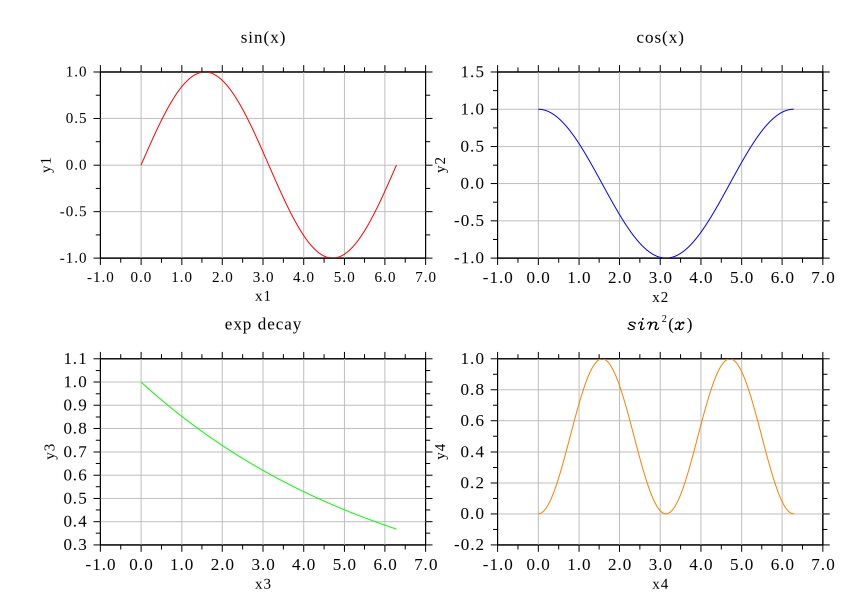   | 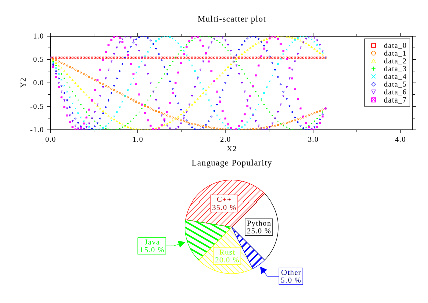 |
| 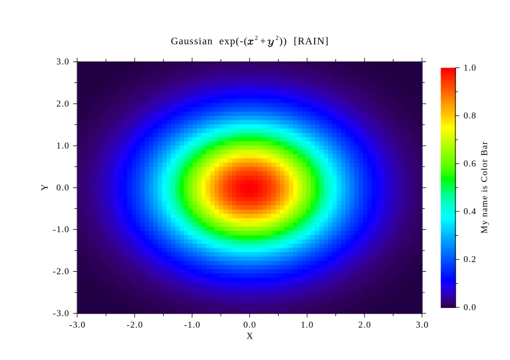      | 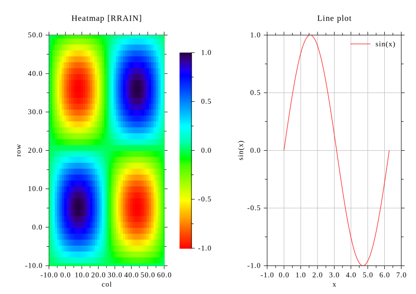        |


---

## 目录

1. [快速开始](#1-快速开始)
2. [初始化窗口 — `figure()`](#2-初始化窗口--figure)
3. [图表类型](#3-图表类型)
   - [折线图 — `plot()`](#31-折线图--plot)
   - [散点图 — `scatter()`](#32-散点图--scatter)
   - [柱状图 — `bar()`](#33-柱状图--bar)
   - [分组柱状图 — `bar_grouped()`](#34-分组柱状图--bar_grouped)
   - [饼图 — `pie()`](#35-饼图--pie)
   - [直方图 — `hist()`](#36-直方图--hist)
4. [外观设置](#4-外观设置)
5. [坐标轴范围](#5-坐标轴范围)
6. [文字注释 — `text()`](#6-文字注释--text)
7. [颜色说明](#7-颜色说明)
8. [输出 — `show()` / `savefig()`](#8-输出--show--savefig)
9. [多子图布局](#9-多子图布局)
10. [编译链接说明](#10-编译链接说明)

---

## 1. 快速开始

```cpp
#include "DislinPlot.h"

int main() 
{
    std::vector<double> x = {0, 1, 2, 3, 4};
    std::vector<double> y = {0, 1, 4, 9, 16};

    DislinPlot plt;
    plt.figure("Signal Window");   // 窗口标题（仅支持英文）
    plt.plot(x, y, "red");
    plt.xlabel("Time (s)");        // X 轴标签
    plt.ylabel("Amplitude");       // Y 轴标签
    plt.title("My Signal");        // 图表标题
    plt.grid("on");
    plt.show();                    // 渲染到屏幕
    // plt.savefig("out.png");     // 或保存到文件
    // plt.savefig("out.svg");     // 或保存到文件
}
```

---

## 2. 初始化窗口 — `figure()`

```cpp
plt.figure(win_title, output, page);
```

| 参数         | 类型          | 默认值     | 说明                                                    |
|------------|-------------|---------|-------------------------------------------------------|
| `win_title` | `string`    | `"DislinPlot"` | 窗口标题栏显示的文字                                  |
| `output`    | `string`    | `"cons"`       | 输出目标：`"cons"`（屏幕）、`"png"`、`"pdf"`、`"eps"`、`"svg"`、`"emf"`等 |
| `page`      | `string`    | `"da4l"`       | 页面尺寸：`"da4l"`（A4 横向）、`"da4p"`（A4 纵向）等  |

**示例：**

```cpp
plt.figure("Sales Chart", "cons", "da4l");   // 屏幕显示，A4 横向
plt.figure("Report",      "png",  "da4p");   // PNG 输出，A4 纵向
```

> `figure()` 会重置所有状态，每次绘制新图前调用一次即可。

---

## 3. 图表类型

### 3.1 折线图 — `plot()`

```cpp
// 使用 vector
plt.plot(x, y, color, label);

// 使用原始指针
plt.plot(x_ptr, y_ptr, n, color, label);
```

| 参数     | 类型                   | 默认值    | 说明               |
|--------|----------------------|--------|--------------------|
| `x`    | `vector<double>`     | —      | X 轴数据            |
| `y`    | `vector<double>`     | —      | Y 轴数据            |
| `color` | `string`            | `"red"` | 线条颜色            |
| `label` | `string`            | `""`   | 图例标签（非空时自动显示图例）|

**示例：**

```cpp
std::vector<double> t(100), s(100);
for (int i = 0; i < 100; ++i) {
    t[i] = i * 0.1;
    s[i] = std::sin(t[i]);
}
plt.plot(t, s, "steelblue", "sin(t)");  // 图例标签用英文
plt.xlabel("Time (s)");
plt.ylabel("Amplitude");
plt.title("Sine Wave");
```

---

### 3.2 散点图 — `scatter()`

```cpp
plt.scatter(x, y, color, symbol, label);
plt.scatter(x_ptr, y_ptr, n, color, symbol, label);
```

| 参数      | 类型              | 默认值    | 说明                                |
|---------|-----------------|--------|-------------------------------------|
| `color`  | `string`        | `"blue"` | 点的颜色                            |
| `symbol` | `int`           | `21`   | DISLIN 符号索引                     |
| `label`  | `string`        | `""`   | 图例标签                             |

**符号索引：**

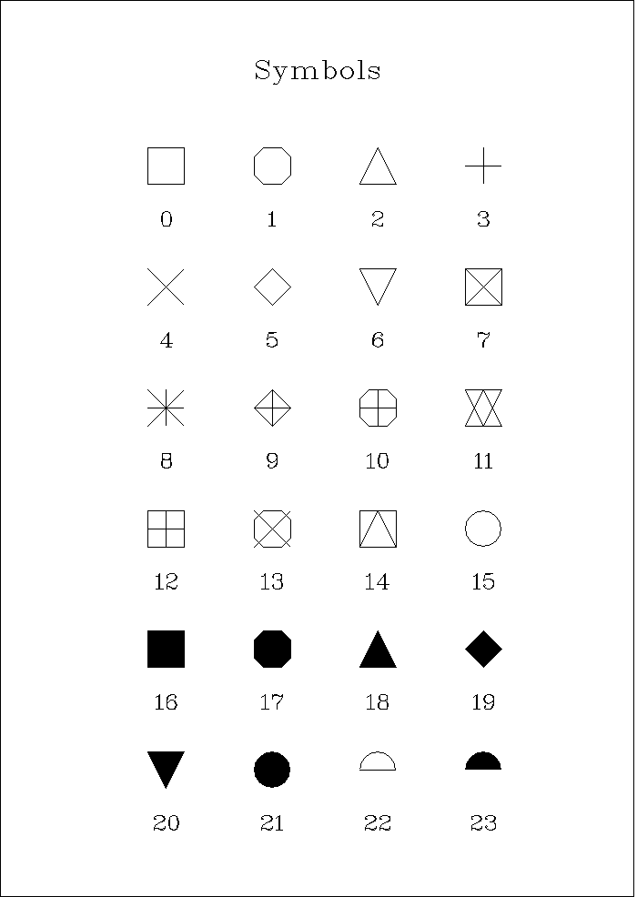

**示例：**

```cpp
plt.scatter(x, y, "orange", 21, "Measured");  // 图例标签用英文
plt.symbol_size(60);   // 调整符号大小（单位：绘图单位，默认 45）
plt.xlabel("X Axis");
plt.ylabel("Y Axis");
plt.title("Scatter Plot");
```

---

### 3.3 柱状图 — `bar()`

```cpp
plt.bar(x, y, color, label);
plt.bar(x_ptr, y_ptr, n, color, label);
```

每根柱子从 `y = 0` 绘制到 `y[i]`。

**示例：**

```cpp
std::vector<double> cats = {1, 2, 3, 4};
std::vector<double> vals = {3.2, 7.1, 5.5, 9.0};
plt.bar(cats, vals, "steelblue", "Monthly Sales");  // 标签用英文
plt.xlabel("Month");
plt.ylabel("Revenue (10k)");
plt.title("Monthly Revenue");
```

---

### 3.4 分组柱状图 — `bar_grouped()`

```cpp
plt.bar_grouped(cats, data, colors, labels);
```

| 参数      | 类型                          | 说明                                  |
|---------|------------------------------|---------------------------------------|
| `cats`   | `vector<double>`             | 各组的 X 位置                         |
| `data`   | `vector<vector<double>>`     | `data[组][类别]`，每组一个 `vector`    |
| `colors` | `vector<string>`             | 每组的颜色（可选）                      |
| `labels` | `vector<string>`             | 每组的图例标签（可选）                   |

**示例：**

```cpp
std::vector<double> cats = {1, 2, 3};

std::vector<std::vector<double>> data = {
    {4.0, 6.0, 5.0},   // 产品 A
    {3.0, 7.0, 4.5},   // 产品 B
};

plt.bar_grouped(cats, data,
    {"steelblue", "orange"},
    {"Product A", "Product B"});  // 图例标签用英文
plt.xlabel("Quarter");
plt.ylabel("Sales");
plt.title("Grouped Sales");
```

---

### 3.5 饼图 — `pie()`

```cpp
plt.pie(values, sliceLabels);
```

| 参数           | 类型              | 说明                          |
|--------------|-----------------|-------------------------------|
| `values`      | `vector<double>` | 各扇形数值（DISLIN 自动归一化）  |
| `sliceLabels` | `vector<string>` | 各扇形标签（可选）              |

**示例：**

```cpp
plt.pie({35, 25, 20, 20},
        {"Marketing", "R&D", "Sales", "Other"});  // 最终图上的数据以百分比形式显示
plt.title("Budget Allocation");
```

---

### 3.6 直方图 — `hist()`

```cpp
plt.hist(data, bins, color, label);
```

| 参数     | 类型              | 默认值       | 说明           |
|--------|-----------------|------------|----------------|
| `data`  | `vector<double>` | —          | 原始数据        |
| `bins`  | `int`           | `10`       | 分组数量        |
| `color` | `string`        | `"steelblue"` | 填充颜色     |
| `label` | `string`        | `""`       | 图例标签        |

**示例：**

```cpp
std::vector<double> samples = { /* 正态分布采样 */ };
plt.hist(samples, 20, "purple", "Distribution");  // 标签用英文
plt.xlabel("Value");
plt.ylabel("Count");
plt.title("Sample Distribution");
```

---

## 4. 外观设置

```cpp
plt.title("Chart Title");       // 主标题（英文）
plt.xlabel("X Label");          // X 轴标签（英文）
plt.ylabel("Y Label");          // Y 轴标签（英文）
plt.grid("on");                 // 显示网格，"on" | "off"（默认 "off"）
plt.legend();                   // 显示图例（有标签时自动触发）
plt.axes_bg(r, g, b);           // 坐标轴背景色，RGB 通道值在 [0, 1]
plt.symbol_size(sz);            // 散点符号大小（绘图单位，默认 45）
plt.title_gap(offset);          // 标题与轴框的垂直距离
                                //   正值 → 标题上移（留更多空间）
                                //   负值 → 标题下移（减少空间）

```

**示例：**

```cpp
plt.title("Annual Sales Trend");
plt.xlabel("Month");
plt.ylabel("Revenue (10k)");
plt.grid("on");
plt.axes_bg(0.95, 0.95, 1.0);  // 淡蓝色背景
plt.title_gap(-200);            // 标题下移
```

---

## 5. 坐标轴范围

```cpp
plt.xlim(lo, hi);   // 手动设置 X 轴范围
plt.ylim(lo, hi);   // 手动设置 Y 轴范围
```

不调用时，范围自动从数据推算。

**示例：**

```cpp
plt.xlim(0.0, 10.0);
plt.ylim(-1.5, 1.5);
```

---

## 6. 文字注释 — `text()`

```cpp
plt.text(msg, x, y);              // 在数据坐标 (x, y) 处绘制文字
plt.text(msg, x, y, color);       // 指定颜色
```

**示例：**

```cpp
plt.text("Peak", 3.14, 1.0, "red");   // 注释文字用英文
plt.text("Start", 0.0, 0.0);
```

---

## 7. 颜色说明

| 类别         | 写法示例                             |
|------------|--------------------------------------|
| DISLIN 内置  | `"red"` `"green"` `"blue"` `"yellow"` `"cyan"` `"white"` `"fore"` |
| 扩展命名色   | `"steelblue"` `"orange"` `"purple"` `"brown"` `"pink"` `"gray"` |
| 自定义 RGB   | `"rgb:0.2,0.6,0.9"`（每通道 [0, 1]） |

---

## 8. 输出 — `show()` / `savefig()`

```cpp
plt.show();                  // 渲染到屏幕（阻塞，直到窗口关闭）
plt.savefig("chart.png");    // 保存为 PNG
plt.savefig("chart.pdf");    // 保存为 PDF
plt.savefig("chart.svg");    // 保存为 SVG
plt.savefig("chart.eps");    // 保存为 EPS
```

文件格式由扩展名自动决定，**推荐使用矢量图格式**，比如svg, pdf等，图片清晰度和分辨率高。

---

## 9. 多子图布局

所有面板数据先收集完毕，`show()` / `savefig()` 时在**同一个** DISLIN 会话中统一渲染。

```cpp
plt.figure("Subplots");
plt.subplot_layout(rows, cols);   // ① 必须在 subplot() 之前调用
```

```cpp
plt.subplot(row, col);            // ② 切换到指定面板（0-based 行列）
// 之后正常调用 plot/bar/... 和外观设置
```

**完整示例（2×2 布局）：**

```cpp
#include "DislinPlot.h"
#include <cmath>

int main() 
{
    const int N = 200;
    std::vector<double> x(N), y_sin(N), y_cos(N), y_sq(N), y_abs(N);
    for (int i = 0; i < N; ++i) {
        x[i]     = i * 0.05;
        y_sin[i] = std::sin(x[i]);
        y_cos[i] = std::cos(x[i]);
        y_sq[i]  = x[i] * x[i] * 0.1;
        y_abs[i] = std::abs(std::sin(x[i]));
    }

    DislinPlot plt;
    plt.figure("2x2 Grid");        // 窗口标题用英文
    plt.subplot_layout(2, 2);

    // 左上
    plt.subplot(0, 0);
    plt.title("sin(x)");
    plt.plot(x, y_sin, "red", "sin");
    plt.grid("on");

    // 右上
    plt.subplot(0, 1);
    plt.title("cos(x)");
    plt.plot(x, y_cos, "steelblue", "cos");
    plt.grid("on");

    // 左下
    plt.subplot(1, 0);
    plt.title("$x^2 * 0.1$");       // TeX instructions
    plt.plot(x, y_sq, "orange");

    // 右下
    plt.subplot(1, 1);
    plt.title("|sin(x)|");
    plt.plot(x, y_abs, "purple");

    plt.show();
}
```

---

## 10. 编译链接说明

根据 **Dislin** [官网要求](https://www.dislin.de/distributions.html)安装好库以后，写一个 `test.cpp` 程序，然后编译并运行 `test`：

```
cpplink -a test
```

